# ASO – UT4 – Práctica 1: Administración remota de sistemas

##  Objetivo de la práctica

El objetivo de esta práctica es comprobar que es posible administrar y monitorizar remotamente sistemas operativos en red, utilizando:

- Herramientas de administración web
- Usuarios específicos para acceso remoto
- Conexiones seguras mediante HTTPS

La práctica se divide en dos partes:

- **Parte A:** Administración remota de Windows Server con **Windows Admin Center (WAC)**
- **Parte B:** Administración remota de Ubuntu Server con **Cockpit**

---

##  Infraestructura utilizada

- **Windows 11** (equipo administrador)
- **Windows Server 2025** (servidor)
- **Ubuntu Server 24.04** (servidor)
- **Red privada**

Todas las conexiones se realizan desde el navegador web del equipo Windows 11.

---

#  PARTE 1 – Windows Admin Center (WAC)

### Herramienta
- **Windows Admin Center**
- **Protocolo:** HTTPS
- **Puerto:** 6600

---

## 1️ Acceso a Windows Admin Center

En primer lugar, se instala Windows Admin Center** en el equipo Windows 11. Durante el proceso de instalación se siguen los pasos del asistente, seleccionando la opción adecuada para el acceso web local.

Una vez finalizada la instalación, se accede a la consola web desde el navegador mediante la siguiente URL:

```
https://localhost:6600
```

Se inicia sesión utilizando un usuario válido del propio sistema Windows 11.

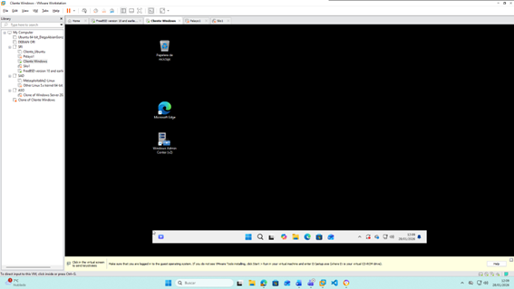
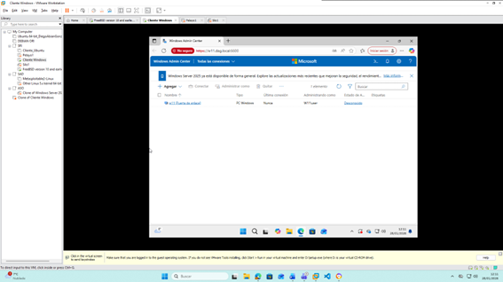

---

## 2️ Administración remota de Windows Server 2025

Desde la consola de Windows Admin Center, se agrega el **Windows Server 2025** como servidor administrado, introduciendo su dirección IP y utilizando credenciales válidas del servidor.

Una vez agregado, se comprueba que es posible:

- Visualizar la información general del sistema
- Monitorizar el uso de CPU y memoria
- Acceder a servicios y eventos del sistema

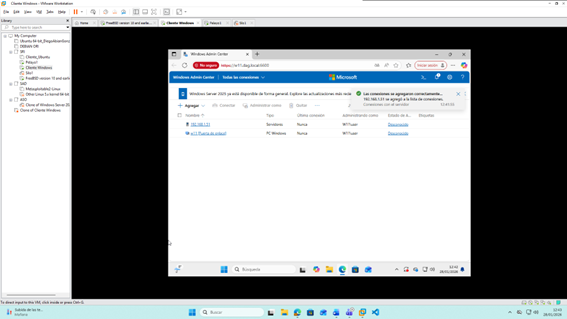
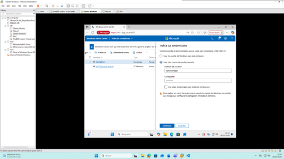
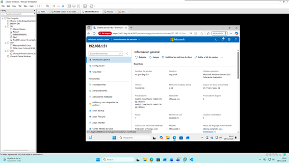
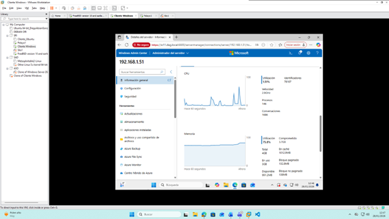
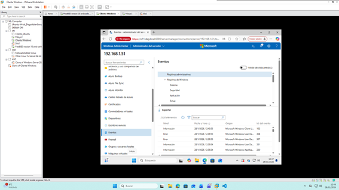
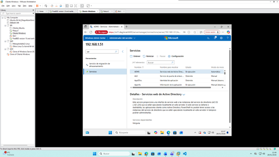

---

## 3️ Documentación técnica – Windows Admin Center

| Sistema administrado | Herramienta            | Protocolo | Puerto |
|----------------------|------------------------|-----------|--------|
| Windows Server 2025  | Windows Admin Center   | HTTPS     | 6600   |

---

#  PARTE 2 – Cockpit (Linux)

### Herramienta
- **Cockpit**
- **Servicio:** cockpit
- **Protocolo:** HTTPS
- **Puerto:** 9090

---

## 1️ Comprobación del servicio Cockpit

En el servidor Ubuntu Server 24.04, se comprueba que el servicio Cockpit está activo y funcionando correctamente, verificando tanto el servicio como el socket.

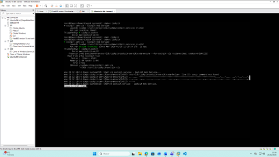

---

## 2️ Creación de usuario remoto para administración

Se crea un usuario específico (distinto de root) para la administración remota del sistema mediante Cockpit. Este usuario se utilizará para acceder de forma segura al servidor desde el navegador web.

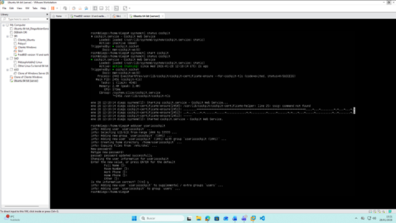

---

## 3️ Acceso remoto a Cockpit desde Windows 11

Desde el navegador del equipo Windows 11, se accede a Cockpit mediante la URL:

```
https://IP_DEL_UBUNTU:9090
```

Tras aceptar el certificado de seguridad, se inicia sesión con el usuario remoto creado anteriormente. Una vez dentro, se comprueba que es posible monitorizar el sistema.

---

## 4️ Monitorización del sistema

Dentro de la interfaz web de Cockpit se visualiza información en tiempo real del sistema, incluyendo:

- Uso de CPU
- Uso de memoria
- Estado general del sistema

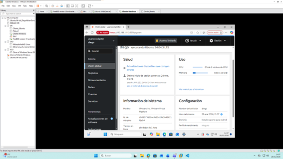

---

## 5️ Documentación técnica – Cockpit

| Sistema        | Usuario remoto | Herramienta | Protocolo | Puerto |
|----------------|----------------|-------------|-----------|--------|
| Ubuntu 24.04   | admincockpit   | Cockpit     | HTTPS     | 9090   |

---

##  Conclusión

Con esta práctica se demuestra que es posible administrar y monitorizar de forma remota sistemas Windows y Linux en red, utilizando herramientas web seguras, usuarios específicos y conexiones cifradas mediante HTTPS.

